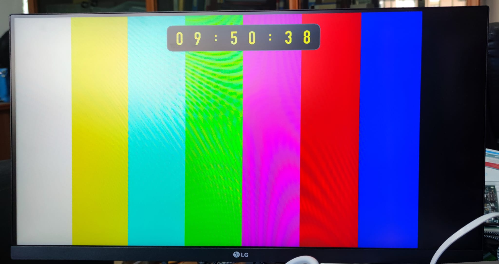

# HDMI_VHDL — HDMI Video Generator for TangNano-20K

VHDL-based HDMI video generator for the **Sipeed Tang Nano 20K** board.
Produces a **1280×720 @ 60 Hz** signal with selectable test patterns and an
**HH:MM:SS** clock overlay.



---

## Features

- **7 selectable test patterns** via push-button:
  | `I_pat_sel` | Pattern |
  |-------------|---------|
  | `000` | Full-screen color bars |
  | `001` | Red grid on black |
  | `010` | Horizontal grayscale gradient |
  | `011` | Full blue |
  | `100` | Full green |
  | `101` | Full red |
  | `110` | Full white |

- **HH:MM:SS clock overlay** with rounded semi-transparent panel
  - DIN Condensed Bold font at 44×56 px with 4-level anti-aliasing (2 bit/px grayscale)
  - Yellow text, colored border, semi-transparent fill
  - 1-second tick derived by counting 60 video frames

- **UART time synchronization** (115200 8N1)
  - Frame format: `HH:MM:SS` + CR/LF or `THH:MM:SS` + CR/LF
  - Helper script: `tools/send_time.py`

---

## Project Structure

```
src/
  video_top.vhd        — Top level: PLL, reset, module integration
  testpattern.vhd      — Pattern generator + clock overlay
  clock_font_pkg.vhd   — Font bitmap ROM (auto-generated)
  key_led_ctrl.vhd     — Button debounce, pattern selection, LEDs
  tmds_rpll.vhd        — Gowin PLL wrapper (rPLL + CLKDIV)
  uart_time_rx.vhd     — UART receiver for time synchronization
  dvi_tx.v             — DVI/TMDS encoder (Gowin IP)
  hdmi.cst             — Pin constraints
  nano_20k_video.sdc   — Timing constraints

tools/
  ttf_to_vhdl_font.py  — Converts a TTF font into clock_font_pkg.vhd
  send_time.py         — Sends the current time over UART to the board

docs/
  HDMI_VHDL_SPEC.md    — Full technical specification
```

---

## Requirements

- **Board**: Sipeed Tang Nano 20K
- **Toolchain**: Gowin EDA (requires `rPLL`, `CLKDIV`, `DVI_TX_Top` primitives)
- **Python 3** + `Pillow` (only needed to regenerate the font)

---

## Regenerating the Font

```bash
python3 -m pip install pillow
python3 tools/ttf_to_vhdl_font.py /path/to/font.ttf \
  --font-size 56 --width 44 --height 56 --grayscale \
  --output src/clock_font_pkg.vhd
```

---

## UART Time Synchronization

```bash
# Send current time once
python3 tools/send_time.py /dev/tty.usbserial-0001

# Send time every second (watch mode)
python3 tools/send_time.py /dev/tty.usbserial-0001 --watch --interval 1

# Direct access via pyftdi (Tang Nano 20K onboard debugger)
python3 tools/send_time.py ftdi://ftdi:2232h/2 --verbose
python3 tools/send_time.py --tang-uart --ftdi-serial 2023030621
```

UART settings: **115200 baud, 8N1, 3.3 V LVCMOS** — board pin `70`.

---

## License

Distributed under the **GNU General Public License v3.0**.
See [LICENSE](LICENSE) for details.
